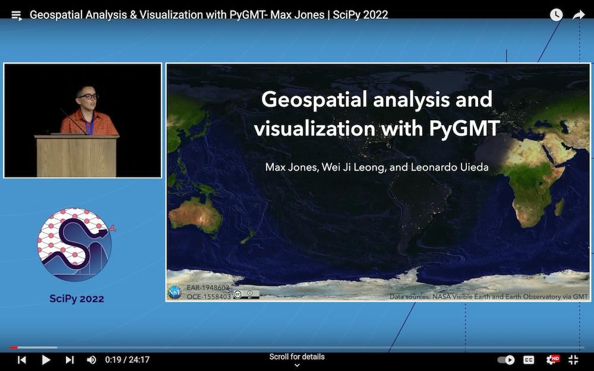

# PyGMT

> A Python interface for the Generic Mapping Tools

[Documentation (development version)](https://www.pygmt.org/dev) | [Contact](https://forum.generic-mapping-tools.org) | [TryOnline](https://github.com/GenericMappingTools/try-gmt)

[](https://pypi.python.org/pypi/pygmt)
[](https://anaconda.org/conda-forge/pygmt)
[](https://github.com/GenericMappingTools/pygmt/actions/workflows/ci_tests.yaml)
[](https://github.com/GenericMappingTools/pygmt/actions/workflows/ci_tests_dev.yaml)
[](https://github.com/astral-sh/ruff)
[](https://app.codecov.io/gh/GenericMappingTools/pygmt)
[](https://codspeed.io/GenericMappingTools/pygmt)
[](https://pypi.python.org/pypi/pygmt)
[](https://forum.generic-mapping-tools.org)
[](https://doi.org/10.5281/zenodo.3781524)
[](https://github.com/pyOpenSci/software-review/issues/43)
[](https://github.com/GenericMappingTools/pygmt/blob/main/LICENSE.txt)
[](https://github.com/GenericMappingTools/.github/blob/main/CODE_OF_CONDUCT.md)

<!-- doc-index-start-after -->

## Why PyGMT?

A beautiful map is worth a thousand words. To truly understand how powerful PyGMT is, play with it online on
[Binder](https://github.com/GenericMappingTools/try-gmt)! For a quicker introduction, check out our
[3 minute overview](https://youtu.be/4iPnITXrxVU)!

Afterwards, feel free to look at our [Tutorials](https://www.pygmt.org/latest/tutorials), visit the
[Gallery](https://www.pygmt.org/latest/gallery), and check out some
[external PyGMT examples](https://www.pygmt.org/latest/external_resources.html)!



## About

PyGMT is a library for processing geospatial and geophysical data and making publication-quality
maps and figures. It provides a Pythonic interface for the
[Generic Mapping Tools (GMT)](https://github.com/GenericMappingTools/gmt), a command-line program
widely used across the Earth, Ocean, and Planetary sciences and beyond.

## Project goals

- Make GMT more accessible to new users.
- Build a Pythonic API for GMT.
- Interface with the GMT C API directly using ctypes (no system calls).
- Support for rich display in the Jupyter notebook.
- Integration with the [PyData ecosystem](https://pydata.org/): `numpy.ndarray` or `pandas.DataFrame` for
  data tables, `xarray.DataArray` for grids, and `geopandas.GeoDataFrame` for geographical data.

## Quickstart

### Installation

Simple installation using [mamba](https://mamba.readthedocs.org/):

```bash
mamba install --channel conda-forge pygmt
```

If you use [conda](https://docs.conda.io/projects/conda/en/latest/user-guide/index.html):

```bash
conda install --channel conda-forge pygmt
```

For other ways to install `pygmt`, see the [full installation instructions](https://www.pygmt.org/latest/install.html).

### Getting started

As a starting point, you can open a [Python interpreter](https://docs.python.org/3/tutorial/interpreter.html)
or a [Jupyter notebook](https://docs.jupyter.org/en/latest/running.html), and try the following example:

``` python
import pygmt
fig = pygmt.Figure()
fig.coast(projection="N15c", region="g", frame=True, land="tan", water="lightblue")
fig.text(position="MC", text="PyGMT", font="80p,Helvetica-Bold,red@75")
fig.show()
```

You should see a global map with land and water masses colored in tan and lightblue, respectively. On top,
there should be the semi-transparent text "PyGMT". For more examples, please have a look at the
[Gallery](https://www.pygmt.org/latest/gallery/index.html) and
[Tutorials](https://www.pygmt.org/latest/tutorials/index.html).

## Contacting us

- Most discussion happens [on GitHub](https://github.com/GenericMappingTools/pygmt).
  Feel free to [open an issue](https://github.com/GenericMappingTools/pygmt/issues/new) or comment on any open
  issue or pull request.
- We have a [Discourse forum](https://forum.generic-mapping-tools.org/c/questions/pygmt-q-a) where you can ask
  questions and leave comments.

## Contributing

### Code of conduct

Please note that this project is released with a
[Contributor Code of Conduct](https://github.com/GenericMappingTools/.github/blob/main/CODE_OF_CONDUCT.md).
By participating in this project you agree to abide by its terms.

### Contributing guidelines

Please read our [Contributing Guide](https://github.com/GenericMappingTools/pygmt/blob/main/CONTRIBUTING.md)
to see how you can help and give feedback.

### Imposter syndrome disclaimer

**We want your help.** No, really.

There may be a little voice inside your head that is telling you that you're not ready to be an open source
contributor; that your skills aren't nearly good enough to contribute. What could you possibly offer?

We assure you that the little voice in your head is wrong.

**Being a contributor doesn't just mean writing code.** Equally important contributions include: writing or
proof-reading documentation, suggesting or implementing tests, or even giving feedback about the project
(including giving feedback about the contribution process). If you're coming to the project with fresh eyes,
you might see the errors and assumptions that seasoned contributors have glossed over. If you can write any
code at all, you can contribute code to open source. We are constantly trying out new skills, making mistakes,
and learning from those mistakes. That's how we all improve and we are happy to help others learn.

*This disclaimer was adapted from the* [MetPy project](https://github.com/Unidata/MetPy).

## Citing PyGMT

PyGMT is a community developed project. See the
[AUTHORS.md](https://github.com/GenericMappingTools/pygmt/blob/main/AUTHORS.md) file on GitHub for a list of
the people involved and a definition of the term "PyGMT Developers". Feel free to cite our work in your
research using the following BibTeX:

```
@software{
  pygmt_2024_13679420,
  author       = {Tian, Dongdong and
                  Uieda, Leonardo and
                  Leong, Wei Ji and
                  Fröhlich, Yvonne and
                  Schlitzer, William and
                  Grund, Michael and
                  Jones, Max and
                  Toney, Liam and
                  Yao, Jiayuan and
                  Magen, Yohai and
                  Tong, Jing-Hui and
                  Materna, Kathryn and
                  Belem, Andre and
                  Newton, Tyler and
                  Anant, Abhishek and
                  Ziebarth, Malte and
                  Quinn, Jamie and
                  Wessel, Paul},
  title        = {{PyGMT: A Python interface for the Generic Mapping Tools}},
  month        = sep,
  year         = 2024,
  publisher    = {Zenodo},
  version      = {0.13.0},
  doi          = {10.5281/zenodo.13679420},
  url          = {https://doi.org/10.5281/zenodo.13679420}
}
```

To cite a specific version of PyGMT, go to our Zenodo page at <https://doi.org/10.5281/zenodo.3781524>
and use the "Export to BibTeX" function there. It is also strongly recommended to cite the
[GMT 6 paper](https://doi.org/10.1029/2019GC008515) (which PyGMT wraps around). Note that some modules
like `dimfilter`, `surface`, and `x2sys` also have their dedicated citations. Further information for
all these can be found at <https://www.generic-mapping-tools.org/cite>.

## License

PyGMT is free software: you can redistribute it and/or modify it under the terms of the
**BSD 3-clause License**. A copy of this license is provided in
[LICENSE.txt](https://github.com/GenericMappingTools/pygmt/blob/main/LICENSE.txt).

## Support

The development of PyGMT has been supported by NSF grants
[OCE-1558403](https://www.nsf.gov/awardsearch/showAward?AWD_ID=1558403) and
[EAR-1948603](https://www.nsf.gov/awardsearch/showAward?AWD_ID=1948602).

## Related projects

Other official wrappers for GMT:

- [GMT.jl](https://github.com/GenericMappingTools/GMT.jl): A Julia wrapper for GMT.
- [gmtmex](https://github.com/GenericMappingTools/gmtmex): A Matlab/Octave wrapper for GMT.

<!-- doc-index-end-before -->

## Minimum supported versions

PyGMT has adopted [SPEC 0](https://scientific-python.org/specs/spec-0000/) alongside the
rest of the Scientific Python ecosystem, and therefore:

- Support for Python versions be dropped 3 years after their initial release.
- Support for core package dependencies (NumPy/Pandas/Xarray) be dropped 2 years after
  their initial release.

Similarly, the PyGMT team has decided to discontinue support for GMT versions 3 years
after their initial release.

Please see [Minimum Supported Versions](https://www.pygmt.org/dev/minversions.html) for
the minimum supported versions of GMT, Python and core package dependencies.
