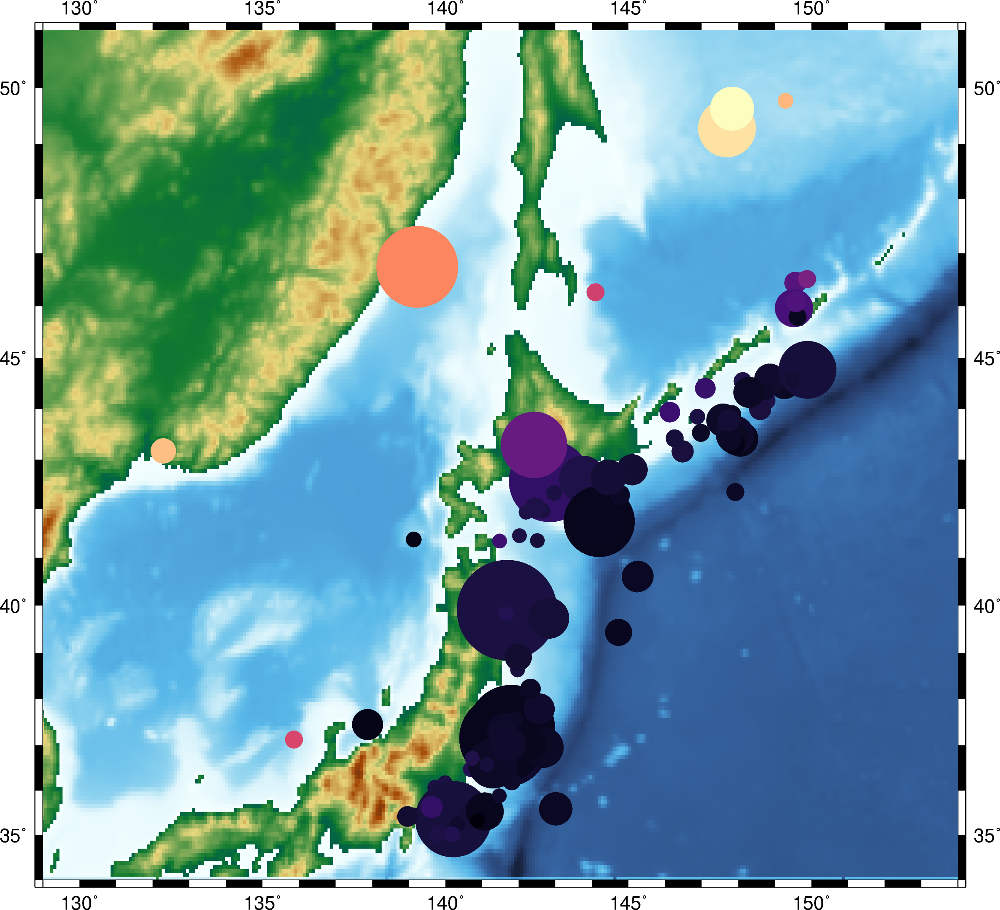

.. raw:: html

    <h1 align="center">GMT/Python</h1>
    <h2 align="center">A Python interface for the Generic Mapping Tools</h2>

    

    
    
    
    
    
    
    
    

    

    <a href="http://try.gmtpython.xyz/">Online Demo</a> |
    <a href="https://www.gmtpython.xyz">Documentation</a> |
    <a href="https://github.com/GenericMappingTools/gmt-python">Source Code</a> |
    <a href="https://gitter.im/GenericMappingTools/gmt-python">Contact</a>
    

.. code:: python

    import gmt

    # Load sample earthquake data in a pandas.DataFrame
    quakes = gmt.datasets.load_usgs_quakes()

    # Load the builtin Earth relief grid as an xarray.DataArray.
    relief = gmt.datasets.load_earth_relief(resolution="30m")

    # The Figure object controls all plotting functions
    fig = gmt.Figure()
    # Setup a map with a global region, a Mollweide projection, and automatic ticks
    fig.basemap(region="g", projection="W200/8i", frame=True)
    # Plot the Earth relief grid in pseudo-color.
    fig.grdimage(relief, cmap="geo")
    # Plot earthquakes as circles. Size maps to magnitude and color to depth.
    fig.plot(x=quakes.longitude, y=quakes.latitude, sizes=0.01*2**quakes.mag,
             color=quakes.depth/quakes.depth.max(), cmap="viridis", style="cc")
    # Show a preview of the image (inline if in a Jupyter notebook).
    fig.show()

Disclaimer
----------

**This package in early stages of design and implementation.**

We welcome any feedback and ideas!
Let us know by submitting
`issues on Github <https://github.com/GenericMappingTools/gmt-python/issues>`__
or send us a message on our
`Gitter chatroom <https://gitter.im/GenericMappingTools/gmt-python>`__.

Getting started
---------------

1. Try an online demo at `try.gmtpython.xyz <http://try.gmtpython.xyz>`__
2. `Install <https://www.gmtpython.xyz/latest/install.html>`__ (Linux and Mac)
3. Follow the `Tutorials <https://www.gmtpython.xyz/latest/tutorials>`__.
4. Take a look at the `API <https://www.gmtpython.xyz/latest/api>`__ to see what is
   available.

Project goals
-------------

* Make GMT more accessible to new users.
* Build a Pythonic API for GMT.
* Interface with the GMT C API directly using ctypes (no system calls).
* Support for rich display in the Jupyter notebook.
* Integration with the Scipy stack: numpy.ndarray or pandas.DataFrame for data tables
  and xarray.DataArray for grids.

Contacting Us
-------------

* Most discussion happens `on Github
  <https://github.com/GenericMappingTools/gmt-python>`__. Feel free to `open an issue
  <https://github.com/GenericMappingTools/gmt-python/issues/new>`__ or comment on any
  open issue or pull request.
* We have a `chat room on Gitter <https://gitter.im/GenericMappingTools/gmt-python>`__
  where you can ask questions and leave comments.
* This project is released with a `Contributor Code of Conduct
  <https://github.com/GenericMappingTools/gmt-python/blob/master/CODE_OF_CONDUCT.md>`__.
  By participating in this project you agree to abide by its terms.

Contributing
------------

Code of conduct
+++++++++++++++

Please note that this project is released with a `Contributor Code of Conduct
<https://github.com/GenericMappingTools/gmt-python/blob/master/CODE_OF_CONDUCT.md>`__.
By participating in this project you agree to abide by its terms.

Contributing Guidelines
+++++++++++++++++++++++

Please read our `Contributing Guide
<https://github.com/GenericMappingTools/gmt-python/blob/master/CONTRIBUTING.md>`__ to
see how you can help and give feedback.

Imposter syndrome disclaimer
++++++++++++++++++++++++++++

**We want your help.** No, really.

There may be a little voice inside your head that is telling you that you're not ready
to be an open source contributor; that your skills aren't nearly good enough to
contribute. What could you possibly offer?

We assure you that the little voice in your head is wrong.

**Being a contributor doesn't just mean writing code**.
Equality important contributions include: writing or proof-reading documentation,
suggesting or implementing tests, or even giving feedback about the project (including
giving feedback about the contribution process). If you're coming to the project with
fresh eyes, you might see the errors and assumptions that seasoned contributors have
glossed over. If you can write any code at all, you can contribute code to open source.
We are constantly trying out new skills, making mistakes, and learning from those
mistakes. That's how we all improve and we are happy to help others learn.

*This disclaimer was adapted from the*
`MetPy project <https://github.com/Unidata/MetPy>`__.

Related projects
----------------

* `GMT.jl <https://github.com/GenericMappingTools/GMT.jl>`__: A Julia wrapper for GMT.
* `gmtmex <https://github.com/GenericMappingTools/GMT.jl>`__: A Matlab/Octave wrapper
  for GMT.

Other Python wrappers for GMT:

* `gmtpy <https://github.com/emolch/gmtpy>`__ by `Sebastian Heimann <https://github.com/emolch>`__
* `pygmt <https://github.com/ian-r-rose/pygmt>`__ by `Ian Rose <https://github.com/ian-r-rose>`__
* `PyGMT <https://github.com/glimmer-cism/PyGMT>`__  by `Magnus Hagdorn <https://github.com/mhagdorn>`__

License
-------

GMT/Python is free software: you can redistribute it and/or modify it under the terms of
the **BSD 3-clause License**. A copy of this license is provided in ``LICENSE.txt``.
