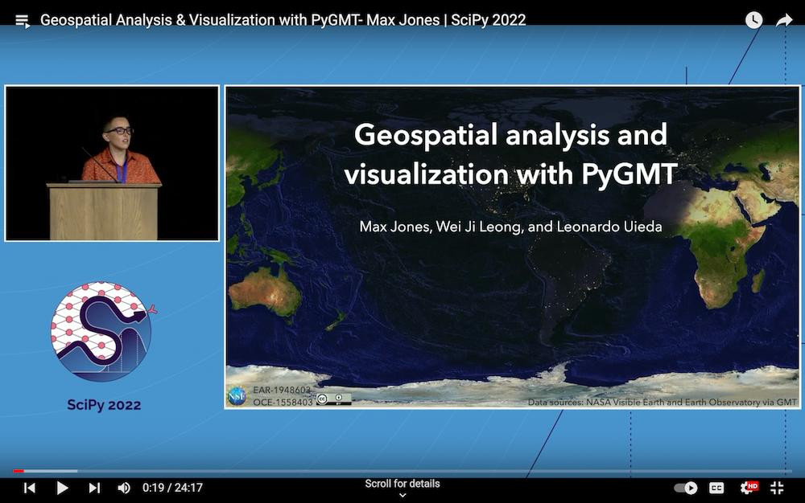
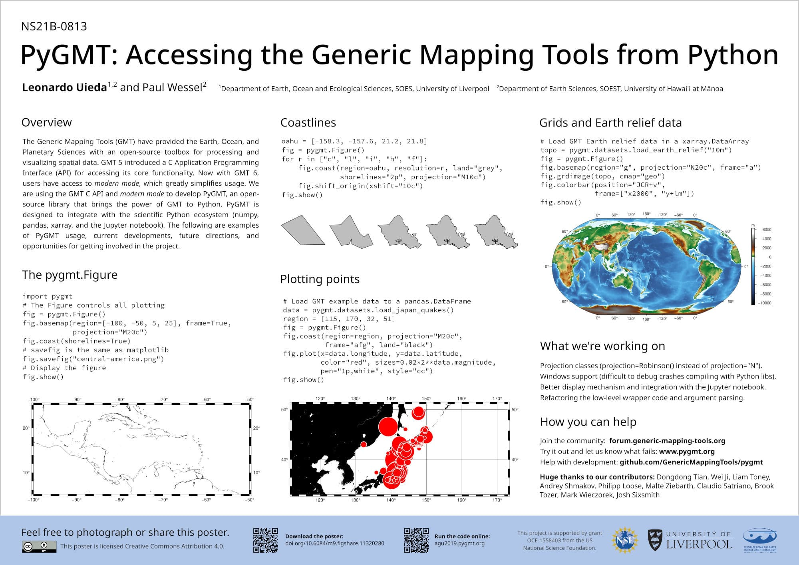
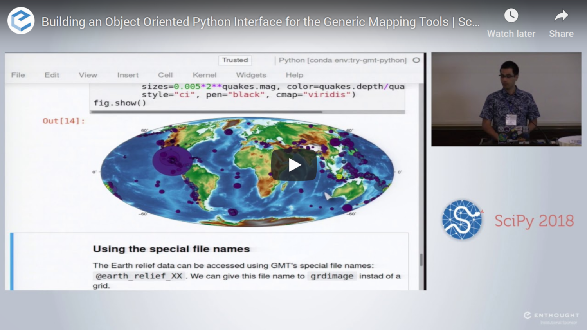
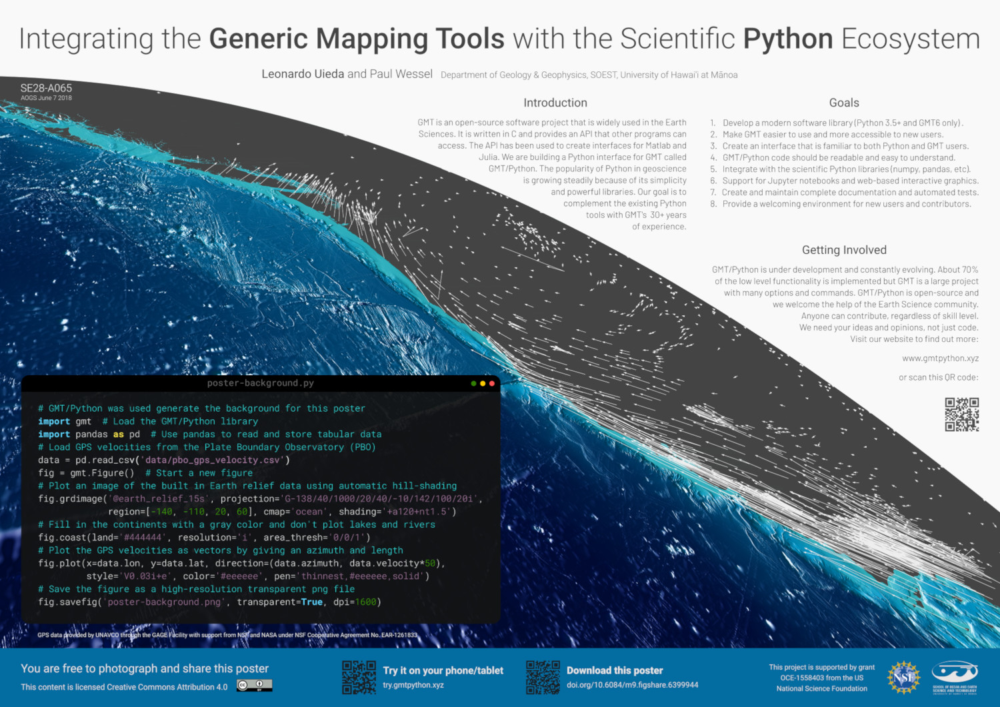
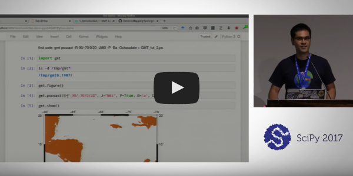
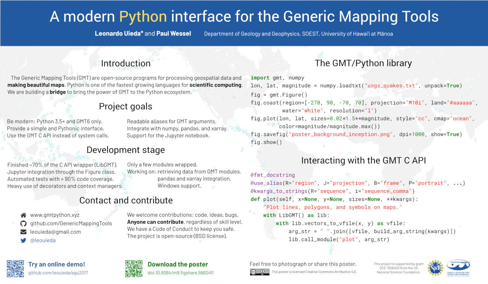

# Conference Presentations

These are conference presentations about the development of PyGMT (previously "GMT/Python"):

-   "Accessing and Integrating GMT with Python and the Scientific Python Ecosystem".
    2024.
	Yvonne Fröhlich, Dongdong Tian, Wei Ji Leong, Max Jones, and Michael Grund.
	Presented at *AGU 2024*.
	doi:[10.6084/m9.figshare.28049495](https://doi.org/10.6084/m9.figshare.28049495)

    {.align-center width="80%"}

-   "Geospatial Analysis & Visualization with PyGMT".
    2022.
    Max Jones, Wei Ji Leong, and Leonardo Uieda.
    Presented at *SciPy 2022*.
    doi:[10.6084/m9.figshare.20483793](https://doi.org/10.6084/m9.figshare.20483793).
    Recording available at <https://www.youtube.com/watch?v=nCktihu9bWg>

    [{.align-center width="80%"}](https://www.youtube.com/watch?v=nCktihu9bWg)

-   "PyGMT: Accessing the Generic Mapping Tools from Python".
    2019.
    Leonardo Uieda and Paul Wessel.
    Presented at *AGU 2019*.
    doi:[10.6084/m9.figshare.11320280](https://doi.org/10.6084/m9.figshare.11320280)

    {.align-center width="80%"}

-   "Building an object-oriented Python interface for the Generic Mapping Tools".
    2018.
    Leonardo Uieda and Paul Wessel.
    Presented at *SciPy 2018*.
    doi:[10.6084/m9.figshare.6814052](https://doi.org/10.6084/m9.figshare.6814052).
    Recording available at <https://www.youtube.com/watch?v=6wMtfZXfTRM>

    [{.align-center width="80%"}](https://www.youtube.com/watch?v=6wMtfZXfTRM)

-   "Integrating the Generic Mapping Tools with the Scientific Python Ecosystem".
    2018.
    Leonardo Uieda and Paul Wessel.
    Presented at *AOGS Annual Meeting 2018*.
    doi:[10.6084/m9.figshare.6399944](https://doi.org/10.6084/m9.figshare.6399944)

    {.align-center width="80%"}

-   "Bringing the Generic Mapping Tools to Python".
    2017.
    Leonardo Uieda and Paul Wessel.
    Presented at *SciPy 2017*.
    doi:[10.6084/m9.figshare.7635833](https://doi.org/10.6084/m9.figshare.7635833).
    Recording available at <https://www.youtube.com/watch?v=93M4How7R24>

    [{.align-center width="80%"}](https://www.youtube.com/watch?v=93M4How7R24)

-   "A modern Python interface for the Generic Mapping Tools".
    2017.
    Leonardo Uieda and Paul Wessel.
    Presented at *AGU 2017*.
    doi:[10.6084/m9.figshare.5662411](https://doi.org/10.6084/m9.figshare.5662411)

    {.align-center width="80%"}
