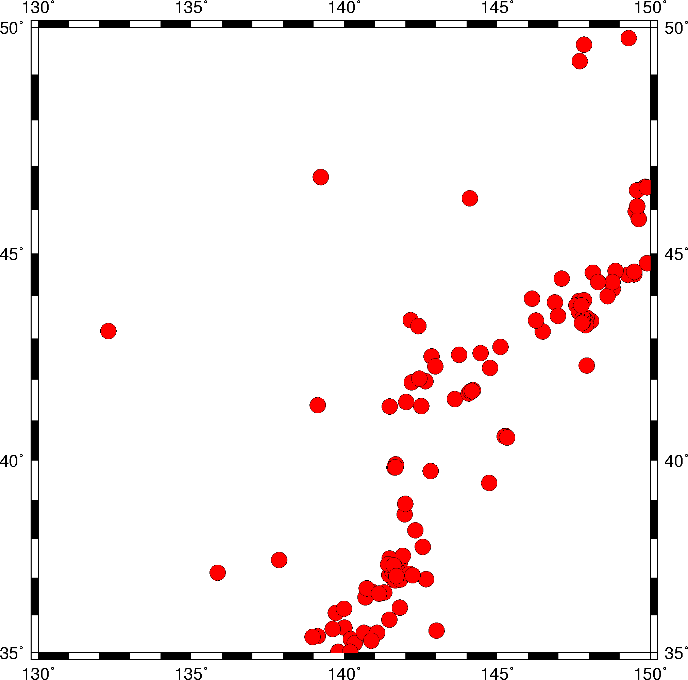

GMT/Python
==========

**A Python interface for the Generic Mapping Tools**

Run GMT in your Python programs:

.. code-block:: python

    import gmt

    # Start a new figure.
    gmt.figure()
    # Creat a basemap and coastlines with the Mercator projection
    # Use the command line arguments you know (like R)
    # or more Pythonic and descriptive aliases.
    gmt.pscoast(region=[130, 150, 35, 50], projection='M6i',
                frame='afg', land='gray', water='lightblue',
                shorelines=True)
    # Plot the quake data from the GMT tutorial
    gmt.psxy(data='@tut_quakes.ngdc', style='c0.3c', color='blue',
             pen='faint', i='4,3')
    # Unlike the GMT command-line interface, no figure
    # file is generated unless explicitly commanded
    gmt.psconvert(prefix='tut_quakes', fmt='G', dpi=200,
                  crop=True, portrait=True)

Get started
-----------

1. Start with the :ref:`first-steps.ipynb` tutorial Jupyter notebook.
2. After that, take a look at the :ref:`api` for a list of modules that are
   already available.

Disclaimer
----------

**This package in early stages of design and implementation.**

We welcome any feedback and ideas!
Code contributions are also very welcome.
Let us know by submitting
`issues on Github <https://github.com/GenericMappingTools/gmt-python/issues>`__
or send us a message on `our Gitter chatroom <https://gitter.im/GenericMappingTools/gmt-python>`__.

.. toctree::
    :maxdepth: 2
    :hidden:

    install.rst
    first-steps.ipynb
    api.rst
    design.rst
    contribute.rst
    license.rst
