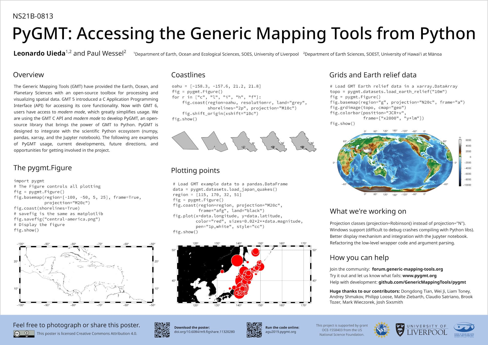

# Overview

## About

PyGMT is a Python wrapper for the
[Generic Mapping Tools (GMT)](https://github.com/GenericMappingTools/gmt),
a command-line program widely used across the Earth, Ocean, and Planetary sciences and
beyond. It provides capabilities for processing spatial data (gridding, filtering,
masking, FFTs, etc) and making high quality plots and maps.

PyGMT is different from Python libraries like [Bokeh](https://bokeh.pydata.org/en/latest/)
and [Matplotlib](https://matplotlib.org/), which have a larger focus on interactivity
and allowing different backends. GMT uses the
[PostScript](https://en.wikipedia.org/wiki/PostScript) format to generate high quality
(static) vector graphics for publications, posters, talks, etc. It is memory efficient
and very fast. The PostScript figures can be converted to other formats like PDF, PNG,
and JPG for use on the web and elsewhere. In fact, PyGMT users will usually not have any
contact with the original PostScript files and get only the more convenient formats like
PDF and PNG.

The project was started in 2017 by [Leonardo Uieda](http://www.leouieda.com) and
[Paul Wessel](http://www.soest.hawaii.edu/wessel) (the co-creator and main developer of
GMT) at the University of Hawaiʻi at Mānoa. The development of PyGMT has been supported
by NSF grants [OCE-1558403](https://www.nsf.gov/awardsearch/showAward?AWD_ID=1558403)
and [EAR-1948602](https://www.nsf.gov/awardsearch/showAward?AWD_ID=1948602).

We welcome any feedback and ideas! Let us know by submitting
[issues on GitHub](https://github.com/GenericMappingTools/pygmt/issues) or by posting on
our [Discourse forum](https://forum.generic-mapping-tools.org/c/questions/pygmt-q-a).

## Presentations

These are conference presentations about the development of PyGMT (previously "GMT/Python"):

-   "Geospatial Analysis & Visualization with PyGMT".
    2022.
    Max Jones, Wei Ji Leong, and Leonardo Uieda.
    Presented at *SciPy 2022*.
    doi:[10.6084/m9.figshare.20483793](https://doi.org/10.6084/m9.figshare.20483793)

    {.align-center width="80%"}

-   "PyGMT: Accessing the Generic Mapping Tools from Python".
    2019.
    Leonardo Uieda and Paul Wessel.
    Presented at *AGU 2019*.
    doi:[10.6084/m9.figshare.11320280](https://doi.org/10.6084/m9.figshare.11320280)

    {.align-center width="80%"}

-   "Building an object-oriented Python interface for the Generic Mapping Tools".
    2018.
    Leonardo Uieda and Paul Wessel.
    Presented at *SciPy 2018*.
    doi:[10.6084/m9.figshare.6814052](https://doi.org/10.6084/m9.figshare.6814052)

    {.align-center width="80%"}

-   "Integrating the Generic Mapping Tools with the Scientific Python Ecosystem".
    2018.
    Leonardo Uieda and Paul Wessel.
    Presented at *AOGS Annual Meeting 2018*.
    doi:[10.6084/m9.figshare.6399944](https://doi.org/10.6084/m9.figshare.6399944)

    {.align-center width="80%"}

-   "Bringing the Generic Mapping Tools to Python".
    2017.
    Leonardo Uieda and Paul Wessel.
    Presented at *SciPy 2017*.
    doi:[10.6084/m9.figshare.7635833](https://doi.org/10.6084/m9.figshare.7635833)

    {.align-center width="80%"}

-   "A modern Python interface for the Generic Mapping Tools".
    2017.
    Leonardo Uieda and Paul Wessel.
    Presented at *AGU 2017*.
    doi:[10.6084/m9.figshare.5662411](https://doi.org/10.6084/m9.figshare.5662411)

    {.align-center width="80%"}
