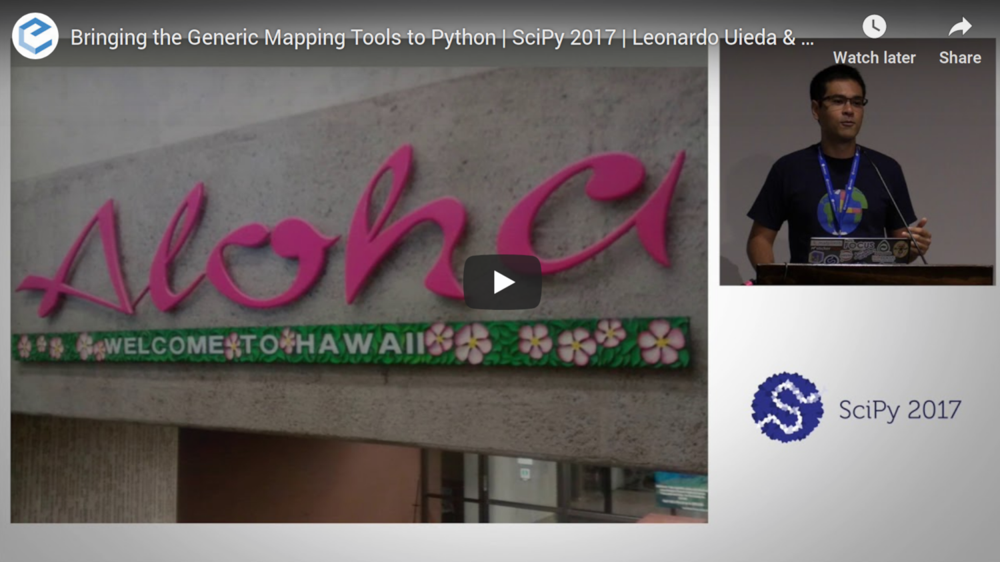

Overview
========

About
-----

PyGMT is a Python wrapper for the
`Generic Mapping Tools (GMT) <https://github.com/GenericMappingTools/gmt>`__, a
command-line program widely used in the Earth Sciences.
It provides capabilities for processing spatial data (gridding, filtering, masking,
FFTs, etc) and making high quality plots and maps.

PyGMT is different from Python libraries like
`Bokeh <https://bokeh.pydata.org/en/latest/>`__
and `Matplotlib <https://matplotlib.org/>`__, which have a larger focus on interactivity
and allowing different backends.
GMT uses the `PostScript <https://en.wikipedia.org/wiki/PostScript>`__ format to
generate high quality (static) vector graphics for publications, posters, talks, etc.
It is memory efficient and very fast.
The PostScript figures can be converted to other formats like PDF, PNG, and JPG for use
on the web and elsewhere.
In fact, PyGMT users will usually not have any contact with the original PostScript
files and get only the more convenient formats like PDF and PNG.

The project was started in 2017 by `Leonardo Uieda <http://www.leouieda.com>`__
and `Paul Wessel <http://www.soest.hawaii.edu/wessel>`__ (the co-creator and main
developer of GMT) at the University of Hawaii at Manoa.
The development of PyGMT was funded by
`NSF grant OCE-1558403 <https://www.nsf.gov/awardsearch/showAward?AWD_ID=1558403>`__.

Presentations
-------------

These are conference presentations about the development of PyGMT (previously
"GMT/Python"):

* "Building an object-oriented Python interface for the Generic Mapping Tools".
  2018.
  Leonardo Uieda and Paul Wessel.
  Presented at *Scipy 2018*.
  doi:`10.6084/m9.figshare.6814052 <https://doi.org/10.6084/m9.figshare.6814052>`__

.. figure:: _static/scipy2018-youtube-thumbnail.png
   :target: https://www.youtube.com/watch?v=6wMtfZXfTRM
   :align: center
   :alt: Scipy youtube video

* "Integrating the Generic Mapping Tools with the Scientific Python Ecosystem".
  2018.
  Leonardo Uieda and Paul Wessel.
  Presented at *AOGS Annual Meeting 2018*.
  doi:`10.6084/m9.figshare.6399944 <https://doi.org/10.6084/m9.figshare.6399944>`__

.. figure:: _static/aogs2018-poster.jpg
   :target: https://doi.org/10.6084/m9.figshare.6399944
   :align: center
   :alt: AOGS poster on figshare

* "Bringing the Generic Mapping Tools to Python".
  2017.
  Leonardo Uieda and Paul Wessel.
  Presented at *Scipy 2017*.
  doi:`10.6084/m9.figshare.7635833 <https://doi.org/10.6084/m9.figshare.7635833>`__

* "A modern Python interface for the Generic Mapping Tools".
  2017.
  Leonardo Uieda and Paul Wessel.
  Presented at *AGU 2017*.
  doi:`10.6084/m9.figshare.5662411 <https://doi.org/10.6084/m9.figshare.5662411>`__

.. figure:: _static/agu2017-poster.jpg
   :target: https://doi.org/10.6084/m9.figshare.5662411
   :align: center
   :alt: AGU poster on figshare
